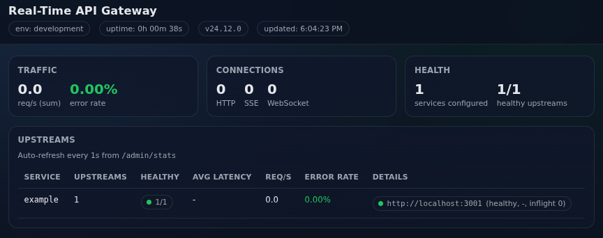

# Real-Time API Gateway

A high-concurrency Node.js API gateway built for low-latency delivery and long-lived connections.

## Features

- Proxies HTTP APIs, SSE streams, and WebSocket connections to multiple upstreams per service.
- Per-request tracing with `x-request-id` (generated or propagated), and forwarded to upstreams.
- Smarter upstream selection using a least-load + latency-aware score.
- Simple circuit breaker to temporarily stop routing to failing upstreams.
- In-memory per-upstream stats exposed via `GET /admin/stats`.
- Prometheus metrics at `GET /metrics`.
- Optional rate limiting and optional in-memory response cache for safe GET requests.

## Architecture (high-level)

- **Ingress**
  - HTTP APIs: `ANY /api/:service/*`
  - Server-Sent Events: `GET|HEAD /sse/:service/*`
  - WebSocket bridge: `GET /ws/:service?path=/...`
- **Upstream selection**
  - `gatewayState.pick(service)` chooses an upstream based on inflight load and latency.
  - A simple circuit breaker excludes failing upstreams for a short cool-down window.
- **Request tracing**
  - The gateway sets `x-request-id` on every response and forwards it to upstreams.
  - If an incoming request already has `x-request-id`, it is preserved.

## Dashboard

The gateway ships with a minimal live admin dashboard.

- `GET /admin` (HTML dashboard)
- `GET /admin/stats` (JSON data powering the dashboard)

<p align="center">
  
</p>

## Requirements

- Node.js 20+ (see `package.json` `engines`)
- npm

## Quickstart

```bash
npm install
cp .env.example .env
npm run dev
```

## Running

### Development

```bash
npm run dev
```

### Production

```bash
npm run build
npm start
```

## Configuration

Configuration is provided through environment variables and validated on startup. Invalid configuration fails fast.

See `.env.example` for the full list.

### Common environment variables

- `UPSTREAMS` (required): JSON map of service name -> array of upstream base URLs
- `AUTH_REQUIRED`, `JWT_SECRET` (optional): protect proxy + admin routes with JWT
- `HTTP_PROXY_TIMEOUT_MS`: upstream timeout (HTTP/SSE)
- `RATE_LIMIT_MAX`, `RATE_LIMIT_WINDOW_MS`: request rate limiting
- `CACHE_ENABLED`, `CACHE_DEFAULT_TTL_MS`, `CACHE_MAX_BODY_BYTES`: safe GET response caching
- `WS_MAX_BUFFERED_BYTES`, `WS_PING_INTERVAL_MS`: WebSocket backpressure + keepalive tuning

### `UPSTREAMS`

`UPSTREAMS` must be valid JSON. It maps service names to one or more upstream base URLs.

Example:

```env
UPSTREAMS={"users":["http://localhost:3001"],"billing":["http://localhost:3002","http://localhost:3003"]}
```

### Authentication

- If `AUTH_REQUIRED=true`, `JWT_SECRET` is required and must be at least 32 characters.
- If `AUTH_REQUIRED` is not set, it defaults to `true` in `NODE_ENV=production`, otherwise `false`.

Admin routes (`/admin`, `/admin/stats`) follow the same rule:

- When `AUTH_REQUIRED=true`, they require a valid JWT.
- When `AUTH_REQUIRED=false`, they are open (useful for demos).

## Endpoints

### Proxy routes

- `ANY /api/:service/*`
  - Proxies HTTP requests to one of the configured upstreams for `:service`.
- `GET|HEAD /sse/:service/*`
  - Proxies streaming/SSE-style responses.

### WebSocket bridge

- `GET /ws/:service?path=/some/ws/path` (WebSocket upgrade)
  - Bridges an incoming WebSocket connection to the upstream WebSocket URL.
  - The `path` query parameter selects the upstream WebSocket path (default `/`).

### Operational endpoints

- `GET /healthz`
- `GET /readyz`
- `GET /metrics`
- `GET /admin` (minimal live dashboard)
- `GET /admin/stats` (dashboard data)
- `GET /_pressure` (exposed by `@fastify/under-pressure`)

## Testing

```bash
npm test
```

### Docker

```bash
docker build -t real-time-api-gateway .
docker run --rm -p 8080:8080 --env-file .env real-time-api-gateway

```
